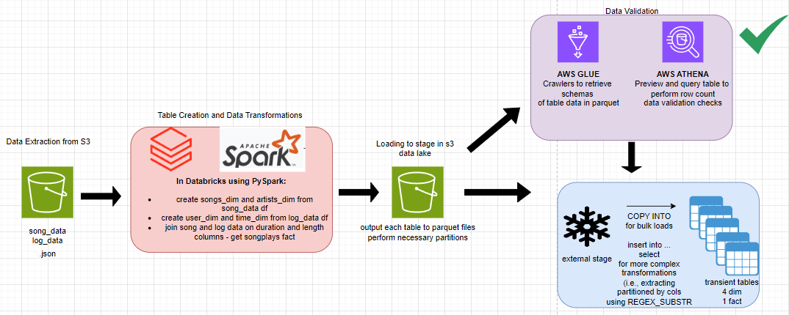

# Project: Million Song Data Lake and Data Warehouse

## DDL SCRIPTS
```sql
CREATE OR REPLACE TRANSIENT TABLE TECHCATALYST_DE.JASON.SONGS_DIM (
    SONG_ID STRING,
    TITLE STRING,
    YEAR STRING,
    ARTIST_ID STRING,
    DURATION FLOAT,
    PARTITION_YEAR STRING,
    PARTITION_ARTIST_ID STRING
);

create or replace TRANSIENT TABLE TECHCATALYST_DE.JASON.USER_DIM (
    userId STRING,
    firstName STRING,
    lastName STRING,
    GENDER STRING,
    LEVEL STRING
);

CREATE OR REPLACE TRANSIENT TABLE TECHCATALYST_DE.JASON.TIME_DIM (
    TS BIGINT,
    DATETIME STRING,
    START_TIME STRING,
    year INT,
    month STRING,
    DAYOFMONTH INT,
    WEEKOFYEAR INT
    PARTITION_YEAR STRING,
    PARTITION_MONTH STRING
);

create or replace TRANSIENT TABLE TECHCATALYST_DE.JASON.ARTIST_DIM(
    artist_id string,
    artist_name string,
    artist_location string,
    artist_latitude double,
    artist_longitude double
);

CREATE OR REPLACE TRANSIENT TABLE TECHCATALYST_DE.JASON.SONGPLAYS_FACT_TEMP (
    SONGPLAY_ID INTEGER,
    TS BIGINT,
    USERID STRING,
    LEVEL STRING,
    SONG_ID STRING,
    ARTIST_ID STRING, 
    SESSIONID INTEGER,
    LOCATION STRING,
    USERAGENT STRING
);
```

## ARCHITECTURE DIAGRAM




## PURPOSE OF THE DATA LAKE AND DATA WAREHOUSE

To achieve Sparkify's analytical goals, the creation of a data lake was instrumental. In the ETL pipeline, a staging area within S3 served as the data lake and captured the parquet files that were written from databricks. Housing the data lake in an S3 bucket also enabled the use of AWS Glue and AWS Athena to perform necessary data validation checks, such as row count, before loading the data into the target tables within Snowflake. Storage in S3 is also relatively inexpensive and allows Sparkify to access the post-transformed data in a centralized location to be used for different areas of the business in a variety of capacities.


## DATABASE SCHEMA DESIGN/ETL PIPELINE

The schema design that was chosen for Sparkify's transformed tables was the star schema, which incorporates a fact table and various dim tables. The fact table, SONGPLAYS_FACT, includes an incremental primary key called songplay_id as well as keys that connect the table to the various dim tables (TS=time_dim.TS, USERID=user_dim.userId, ARTIST_ID=artist_dim.artist_id, SONG_ID=songs_dim.SONG_ID). This schema will prove to be beneficial for Sparkify's analytical needs because it enables faster query processing, easier business reporting, and streamlined join logic.

-Extract

As depicted in the above architecture diagram, the ETL pipeline extracts the raw data in .json file format from an S3 bucket and pulls it into databricks where Spark is leveraged alongside its Python API where the data from the songs and logs json files is loaded into two separate pyspark dataframes. 

-Transform

Transformations are conducted to get 4 dim tables separated into song, artist, user and time. Further extraction is performed on the timestamp column for time_table. The songs and log dataframes are joined on duration and length columns, respectively, to get a songplays_fact table.

-Load

The tables are written in parquet file format to the S3 staging area data lake and row count validation is performed with AWS Glue and AWS Athena.
Now, the files are loaded into Snowflake using external staging. The above DDL statements create the target transient tables. COPY INTO is used for bulk loading and INSERT INTO ... SELECT is used for more complex further data transformations. 

Additionally, 
              
              for songs_dim output: partitioned by 'year' and 'artist_id'
              for time_dim output: partitioned by 'year' and 'month'
              for songplays_fact: partitioned by 'year' and 'month'
              
extracted the partitioned by columns using for example (songs_dim): 

             REGEXP_SUBSTR(METADATA$FILENAME, 'year=(\\d+)', 1, 1, 'e')::STRING AS PARTITION_YEAR,
             REGEXP_SUBSTR(METADATA$FILENAME, 'artist_id=([^/]+)', 1, 1, 'e')::STRING AS PARTITION_ARTIST_ID


# SUMMARY OF PROCESS
- Extract raw json files from s3 bucket
- Use Spark and PySpark in databricks to transform data, create pyspark dataframes holding the tables, and export in parquet format
- Load transformed dim and fact tables into s3 data lake/staging area
- AWS Glue crawler and AWS Athena querying to validate row count before target load
- Load table parquet data from data lake into Snowflake external stage
- Create target table DDL in Snowflake
- COPY INTO bulk load and INSERT INTO for tables that were partitioned when exporting from databricks
